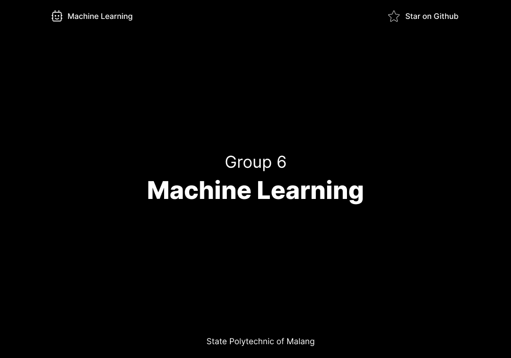

# Quiz 1 - Machine Learning Course

## Group 6

- [Wildan Hafidz Mauludin](https://github.com/nikoshaa)
- [Dhayu Intan Nareswari](https://github.com/DhayuIntan)
- [Farhan Dwi Pramana](https://github.com/FarhanDwiPramana)
- [Mochammad Zaky Zamroni](https://github.com/zakyzuf)
- [Ziedny Bisma Mubarok](https://github.com/Ziedny28)

## Kasus - Klasifikasi Tulisan Tangan dengan Dataset MNIST

## Overview

Anda diminta untuk melakukan klasifikasi dengan menggunakan algoritma **Naive Bayes** dan **SVM** untuk merekognisi tulisan tangan dari dataset MNIST.

## About Dataset MNIST

Dataset **MNIST** (Modified National Institute of Standards and Technology) merupakan dataset berupa citra _grayscale_ dengan ukuran 28x28 yang berisi tulisan tangan dari digit angka 0-9. Jumlah data dalam dataset ini adalah 70.000 data.

## Result

[Group 6 -  Quiz 1](./Group_6_Quiz_1.ipynb)

## Kesimpulan dari Berbagai Metode dan Hasil yang didapat

### 1. SVM

**SVM**(_Support Vector Machine_) adalah salah satu metode klasifikasi yang paling populer dan kuat. _SVM_ adalah metode klasifikasi biner, yang mengklasifikasikan data menjadi dua bagian.

#### 1.1 SVM RBF Kernel Hyperparameter Tuning 

[Wildan Hafidz Mauludin](https://github.com/nikoshaa)

Dilakukan percobaan dengan menggunakan metode **Kernel RBF** dengan berbagai nilai `test_size`, dan dengan hyperparameter tuning. Berikut adalah hasilnya :

| Test Size | Accuracy |
| --------- | -------- |
| 0,3       | 98,54%   |
| 0,2       | 98,58%   |
| 0,1       | 98.64%   |

#### 1.2 SVM Linear Kernel Non Hyper Parameter Tunning

[Ziedny Bisma Mubarok](https://github.com/Ziedny28)

Dilakukan percobaan dengan menggunakan metode **Kernel Linear** dengan berbagai nilai `test_size`, dan non hyperparameter tuning. Berikut adalah hasilnya :

| Test Size | Accuracy |
| --------- | -------- |
| 0,3       | 83,81%   |
| 0,2       | 84,55%   |
| 0,1       | 83,77%   |

### 2. Naive Bayes

**Naive Bayes** adalah sebuah algoritma klasifikasi yang didasarkan pada Teorema Bayes dengan asumsi bahwa fitur-fitur yang digunakan dalam klasifikasi adalah saling independen dan memiliki pengaruh yang sama terhadap kelas yang diinginkan.

#### 2.1 Gaussian Naive Bayes dengan PCA

[Mochammad Zaky Zamroni](https://github.com/zakyzuf)

Dilakukan percobaan dengan menggunakan **Gaussian Naive Bayes** dengan _PCA_ untuk feature reduction, dengan berbagai nilai `test_size`. Berikut adalah hasilnya :

| Test Size | Accuracy |
| --------- | -------- |
| 0,3       | 87,01%   |
| 0,2       | 87,17%   |
| 0,1       | 86,81%   |

#### 2.2 Multinomial Naive Bayes dengan PCA

[Dhayu Intan Nareswari](https://github.com/DhayuIntan)

Dilakukan percobaan dengan menggunakan **Multinomial Naive Bayes** dengan _PCA_ untuk _feature reduction_, dengan berbagai nilai `test_size`. Berikut adalah hasilnya :

| Test Size | Accuracy |
| --------- | -------- |
| 0,3       | 90,34%   |
| 0,2       | 90,42%   |
| 0,1       | 90,37%   |

#### 2.3 Gaussian Naive Bayes dengan Histogram

[Farhan Dwi Pramana](https://github.com/FarhanDwiPramana)

Dilakukan percobaan menggunakan metode **Gaussian Naive Bayes**, _Histogram_ juga digunakan disini, berikut adalah hasilnya:

| Test Size | Accuracy |
| --------- | -------- |
| 0,3       | 56,38%   |
| 0,2       | 56,25%   |
| 0,1       | 56,25%   |

#### Kesimpulan

Lima metode digunakan untuk dilakukan prediksi terhadap dataset _mnist_ yang merupakan gambar tulis tangan, dapat disimpulkan bahwa setelah melakukan proses _tuning hyperparameter_ untuk model **SVM dengan kernel RBF**, metode dengan pengujian menggunakan ukuran data uji sebesar 10% (`test_size` 0.1) terbukti menjadi yang terbaik, menghasilkan akurasi sebesar **98.64%** saat diuji. Metode lain yang menghasilakn akurasi tinggi adalah **Multinomial Naive Bayes** dengan _PCA_ dengan data uji atau `test_size` sebesar 0,2 dengan akurasi **90,42%**.

## License

MIT License
